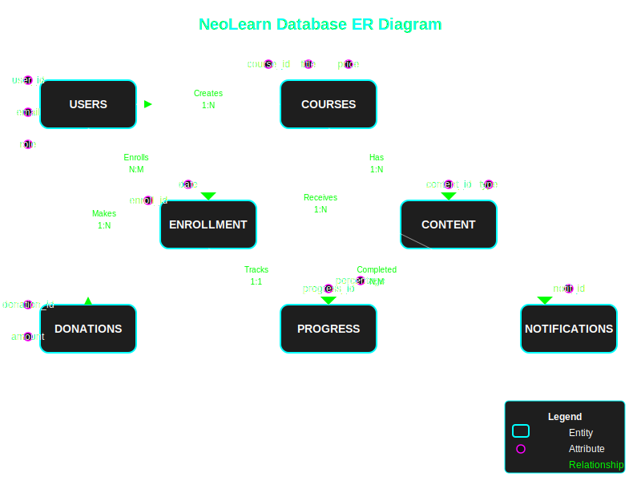

# NeoLearn: Online Learning Platform Project Documentation

## Project Overview

**NeoLearn** is a comprehensive online learning platform that enables users to register, enroll in courses, access educational content, and support the platform through donations. The platform serves three primary user roles:

1. **Admins**: Manage courses, users, and platform settings
2. **Instructors**: Create and manage course content
3. **Students**: Register, enroll in courses, and access content

The platform features a dark-themed UI with neon color accents for a modern, engaging user experience.

## Database Design

### Entity-Relationship Diagram

The ER diagram illustrates the database structure, showcasing the relationships between entities like users, courses, enrollments, content, progress tracking, donations, and notifications.



### Database Schema

The database schema consists of multiple tables organized into the following functional areas:

#### User Management
- **users**: Stores user information, credentials, and roles
- **user_sessions**: Tracks active sessions for authentication

#### Course Management
- **categories**: Course categorization hierarchy
- **courses**: Main course information
- **course_sections**: Organizational units within courses
- **lecture_types**: Types of lecture content (video, text, etc.)
- **course_lectures**: Individual content pieces within sections

#### Enrollment Management
- **enrollments**: Records of student course enrollments
- **progress_tracking**: Student progress through course content

#### Donation Management
- **donation_tiers**: Predefined donation levels and benefits
- **donations**: Records of user donations

#### Notification System
- **notification_types**: Categories of notifications
- **notifications**: User notifications

#### Rating and Review System
- **reviews**: Course reviews and ratings

#### Platform Settings
- **platform_settings**: Global configuration options

## Advanced Database Features

### Triggers

#### 1. Update Enrollment Completion Status

This trigger automatically updates a student's course completion status when their progress on individual lectures changes.

```sql
DELIMITER //
CREATE TRIGGER update_enrollment_completion_status
AFTER UPDATE ON progress_tracking
FOR EACH ROW
BEGIN
    DECLARE total_lectures INT;
    DECLARE completed_lectures INT;
    DECLARE enrollment INT;
    
    SET enrollment = NEW.enrollment_id;
    
    -- Get the total number of lectures for this enrollment
    SELECT COUNT(l.lecture_id) INTO total_lectures
    FROM course_lectures l
    JOIN course_sections s ON l.section_id = s.section_id
    JOIN enrollments e ON s.course_id = e.course_id
    WHERE e.enrollment_id = enrollment;
    
    -- Get the number of completed lectures
    SELECT COUNT(p.progress_id) INTO completed_lectures
    FROM progress_tracking p
    WHERE p.enrollment_id = enrollment AND p.status = 'completed';
    
    -- Update the enrollment status
    IF completed_lectures = 0 THEN
        UPDATE enrollments SET completion_status = 'not_started' WHERE enrollment_id = enrollment;
    ELSEIF completed_lectures = total_lectures THEN
        UPDATE enrollments SET completion_status = 'completed' WHERE enrollment_id = enrollment;
    ELSE
        UPDATE enrollments SET completion_status = 'in_progress' WHERE enrollment_id = enrollment;
    END IF;
END //
DELIMITER ;
```

#### 2. Create Progress Tracking Entries After Enrollment

This trigger automatically creates progress tracking entries for all lectures in a course when a student enrolls.

```sql
DELIMITER //
CREATE TRIGGER create_progress_entries_after_enrollment
AFTER INSERT ON enrollments
FOR EACH ROW
BEGIN
    INSERT INTO progress_tracking (enrollment_id, lecture_id, status)
    SELECT NEW.enrollment_id, l.lecture_id, 'not_started'
    FROM course_lectures l
    JOIN course_sections s ON l.section_id = s.section_id
    WHERE s.course_id = NEW.course_id;
END //
DELIMITER ;
```

#### 3. Notify When Course is Published

This trigger sends a notification to the instructor when their course is published.

```sql
DELIMITER //
CREATE TRIGGER notify_course_published
AFTER UPDATE ON courses
FOR EACH ROW
BEGIN
    IF NEW.is_published = 1 AND OLD.is_published = 0 THEN
        -- Get notification type ID for course publication
        DECLARE notification_type_id INT;
        SELECT type_id INTO notification_type_id FROM notification_types WHERE name = 'Course Published';
        
        -- Notify the instructor
        INSERT INTO notifications (user_id, type_id, title, message)
        VALUES (NEW.instructor_id, notification_type_id, 
                CONCAT('Course Published: ', NEW.title), 
                CONCAT('Your course "', NEW.title, '" has been published and is now available to students.'));
    END IF;
END //
DELIMITER ;
```

### Stored Procedures

#### 1. Enroll Student in a Course

```sql
DELIMITER //
CREATE PROCEDURE enroll_student(IN p_user_id INT, IN p_course_id INT)
BEGIN
    DECLARE existing_enrollment INT;
    
    -- Check if enrollment already exists
    SELECT COUNT(*) INTO existing_enrollment 
    FROM enrollments 
    WHERE user_id = p_user_id AND course_id = p_course_id;
    
    -- If not enrolled, create a new enrollment
    IF existing_enrollment = 0 THEN
        INSERT INTO enrollments (user_id, course_id)
        VALUES (p_user_id, p_course_id);
        
        SELECT 'Enrollment successful' AS message;
    ELSE
        SELECT 'Already enrolled in this course' AS message;
    END IF;
END //
DELIMITER ;
```

#### 2. Calculate Course Progress

```sql
DELIMITER //
CREATE PROCEDURE calculate_course_progress(IN p_enrollment_id INT, OUT p_progress_percentage DECIMAL(5,2))
BEGIN
    DECLARE total_lectures INT;
    DECLARE completed_lectures INT;
    
    -- Get total number of lectures
    SELECT COUNT(l.lecture_id) INTO total_lectures
    FROM course_lectures l
    JOIN course_sections s ON l.section_id = s.section_id
    JOIN enrollments e ON s.course_id = e.course_id
    WHERE e.enrollment_id = p_enrollment_id;
    
    -- Get completed lectures
    SELECT COUNT(p.progress_id) INTO completed_lectures
    FROM progress_tracking p
    WHERE p.enrollment_id = p_enrollment_id AND p.status = 'completed';
    
    -- Calculate percentage
    IF total_lectures > 0 THEN
        SET p_progress_percentage = (completed_lectures / total_lectures) * 100;
    ELSE
        SET p_progress_percentage = 0;
    END IF;
END //
DELIMITER ;
```

### Views

#### 1. Course Analytics View

```sql
CREATE VIEW course_analytics AS
SELECT 
    c.course_id,
    c.title,
    u.first_name AS instructor_first_name,
    u.last_name AS instructor_last_name,
    cat.name AS category,
    COUNT(DISTINCT e.enrollment_id) AS total_enrollments,
    AVG(r.rating) AS average_rating,
    COUNT(DISTINCT r.review_id) AS total_reviews,
    SUM(CASE WHEN e.completion_status = 'completed' THEN 1 ELSE 0 END) AS students_completed,
    (SUM(CASE WHEN e.completion_status = 'completed' THEN 1 ELSE 0 END) / NULLIF(COUNT(DISTINCT e.enrollment_id), 0)) * 100 AS completion_rate
FROM 
    courses c
    LEFT JOIN users u ON c.instructor_id = u.user_id
    LEFT JOIN categories cat ON c.category_id = cat.category_id
    LEFT JOIN enrollments e ON c.course_id = e.course_id
    LEFT JOIN reviews r ON e.enrollment_id = r.enrollment_id
GROUP BY 
    c.course_id, c.title, u.first_name, u.last_name, cat.name;
```

#### 2. Student Progress View

```sql
CREATE VIEW student_progress AS
SELECT 
    u.user_id,
    u.username,
    u.first_name,
    u.last_name,
    c.course_id,
    c.title AS course_title,
    e.enrollment_date,
    e.completion_status,
    COUNT(DISTINCT l.lecture_id) AS total_lectures,
    SUM(CASE WHEN pt.status = 'completed' THEN 1 ELSE 0 END) AS completed_lectures,
    (SUM(CASE WHEN pt.status = 'completed' THEN 1 ELSE 0 END) / NULLIF(COUNT(DISTINCT l.lecture_id), 0)) * 100 AS progress_percentage
FROM 
    users u
    JOIN enrollments e ON u.user_id = e.user_id
    JOIN courses c ON e.course_id = c.course_id
    JOIN course_sections cs ON c.course_id = cs.course_id
    JOIN course_lectures l ON cs.section_id = l.section_id
    LEFT JOIN progress_tracking pt ON e.enrollment_id = pt.enrollment_id AND l.lecture_id = pt.lecture_id
WHERE 
    u.role = 'student'
GROUP BY 
    u.user_id, u.username, u.first_name, u.last_name, c.course_id, c.title, e.enrollment_date, e.completion_status;
```

## Frontend Implementation

The frontend is implemented using HTML, CSS, and JavaScript with a responsive design that works on various device sizes.

### Key Components:

1. **Login System**: A secure authentication system with JWT tokens
2. **User Dashboard**: Customized dashboards for each user role
3. **Course Interface**: Interactive learning environment with progress tracking
4. **Donation System**: Multiple tiers with subscription options
5. **Admin Panel**: Comprehensive management tools
6. **Responsive Design**: Mobile-friendly interface

### Site Pages:

1. **Login Page**: User authentication
2. **Registration Page**: New user signup
3. **Student Dashboard**: Overview of enrolled courses and progress
4. **Course Interface**: Content delivery with interactive elements
5. **Instructor Dashboard**: Course management and analytics
6. **Admin Dashboard**: Platform-wide management tools
7. **Donation Page**: Support options and tiers

## Backend Implementation

The backend is implemented using:

1. **Node.js with Express**: API endpoints for all platform features
2. **MySQL Database**: Relational database with advanced features
3. **JWT Authentication**: Secure token-based authentication
4. **File Upload Handling**: For course content and user avatars
5. **API Security**: Rate limiting, input validation, and XSS protection

## API Endpoints

The API is organized into logical groups:

1. **Authentication**: Registration, login, and session management
2. **User Management**: Profile operations and role-based permissions
3. **Course Management**: CRUD operations for courses and content
4. **Enrollment**: Course enrollment and progress tracking
5. **Donation**: Processing and managing donations
6. **Notifications**: User notification management
7. **Analytics**: Reporting and insights

## Security Features

1. **Password Hashing**: Secure password storage using bcrypt
2. **JWT Authentication**: Stateless token-based authentication
3. **Input Validation**: Protection against injection attacks
4. **Rate Limiting**: Prevention of brute force attacks
5. **CORS Configuration**: Prevention of cross-origin issues
6. **XSS Protection**: Preventing cross-site scripting

## Data Model Examples

### User Model

```sql
CREATE TABLE users (
    user_id INT AUTO_INCREMENT PRIMARY KEY,
    username VARCHAR(50) UNIQUE NOT NULL,
    email VARCHAR(100) UNIQUE NOT NULL,
    password VARCHAR(255) NOT NULL,
    first_name VARCHAR(50) NOT NULL,
    last_name VARCHAR(50) NOT NULL,
    profile_picture VARCHAR(255) DEFAULT 'default-avatar.png',
    role ENUM('admin', 'instructor', 'student') NOT NULL,
    bio TEXT,
    created_at TIMESTAMP DEFAULT CURRENT_TIMESTAMP,
    updated_at TIMESTAMP DEFAULT CURRENT_TIMESTAMP ON UPDATE CURRENT_TIMESTAMP
);
```

### Course Model

```sql
CREATE TABLE courses (
    course_id INT AUTO_INCREMENT PRIMARY KEY,
    title VARCHAR(255) NOT NULL,
    description TEXT NOT NULL,
    instructor_id INT NOT NULL,
    category_id INT NOT NULL,
    thumbnail VARCHAR(255) DEFAULT 'default-course.png',
    price DECIMAL(10,2) DEFAULT 0.00,
    is_published BOOLEAN DEFAULT FALSE,
    created_at TIMESTAMP DEFAULT CURRENT_TIMESTAMP,
    updated_at TIMESTAMP DEFAULT CURRENT_TIMESTAMP ON UPDATE CURRENT_TIMESTAMP,
    FOREIGN KEY (instructor_id) REFERENCES users(user_id) ON DELETE CASCADE,
    FOREIGN KEY (category_id) REFERENCES categories(category_id)
);
```

### Enrollment Model

```sql
CREATE TABLE enrollments (
    enrollment_id INT AUTO_INCREMENT PRIMARY KEY,
    user_id INT NOT NULL,
    course_id INT NOT NULL,
    enrollment_date TIMESTAMP DEFAULT CURRENT_TIMESTAMP,
    is_active BOOLEAN DEFAULT TRUE,
    completion_status ENUM('not_started', 'in_progress', 'completed') DEFAULT 'not_started',
    FOREIGN KEY (user_id) REFERENCES users(user_id) ON DELETE CASCADE,
    FOREIGN KEY (course_id) REFERENCES courses(course_id) ON DELETE CASCADE,
    UNIQUE KEY (user_id, course_id)
);
```

## Example Database Queries

### Complex JOIN Query Example: Get Course Progress for a Student

```sql
SELECT 
    c.course_id,
    c.title,
    c.thumbnail,
    CONCAT(u.first_name, ' ', u.last_name) AS instructor_name,
    e.enrollment_date,
    e.completion_status,
    (
        SELECT COALESCE(AVG(progress_percentage), 0)
        FROM progress_tracking pt
        WHERE pt.enrollment_id = e.enrollment_id
    ) AS overall_progress
FROM 
    enrollments e
    JOIN courses c ON e.course_id = c.course_id
    JOIN users u ON c.instructor_id = u.user_id
WHERE 
    e.user_id = 1 -- Replace with actual student ID
ORDER BY 
    e.enrollment_date DESC;
```

### Subquery Example: Get Popular Courses

```sql
SELECT 
    c.course_id,
    c.title,
    COUNT(e.enrollment_id) AS enrollment_count,
    AVG(r.rating) AS average_rating
FROM 
    courses c
    LEFT JOIN enrollments e ON c.course_id = e.course_id
    LEFT JOIN reviews r ON e.enrollment_id = r.enrollment_id
WHERE 
    c.is_published = TRUE
GROUP BY 
    c.course_id, c.title
ORDER BY 
    enrollment_count DESC, average_rating DESC
LIMIT 10;
```

### Using Window Functions: Get Student Rankings by Course Progress

```sql
SELECT 
    u.user_id,
    CONCAT(u.first_name, ' ', u.last_name) AS student_name,
    c.course_id,
    c.title AS course_title,
    sp.progress_percentage,
    RANK() OVER (PARTITION BY c.course_id ORDER BY sp.progress_percentage DESC) as rank_in_course
FROM 
    student_progress sp
    JOIN users u ON sp.user_id = u.user_id
    JOIN courses c ON sp.course_id = c.course_id
ORDER BY 
    c.course_id, rank_in_course;
```

## DDL Commands Used

1. **CREATE TABLE**: Creating database tables
2. **CREATE TRIGGER**: Creating database triggers
3. **CREATE PROCEDURE**: Creating stored procedures
4. **CREATE VIEW**: Creating database views
5. **ALTER TABLE**: Modifying table structures

## DML Commands Used

1. **INSERT**: Adding new records
2. **SELECT**: Retrieving data
3. **UPDATE**: Modifying existing records
4. **DELETE**: Removing records

## DCL Commands Used

1. **GRANT**: Assigning privileges to users
2. **REVOKE**: Removing privileges from users

## Implementation Challenges and Solutions

### Challenge 1: Complex Progress Tracking

**Problem**: Tracking student progress across multiple levels (courses, sections, lectures) with different completion statuses.

**Solution**: Implemented a hierarchical progress tracking system with automatic rollup calculations using triggers that update enrollment status based on individual lecture completion.

### Challenge 2: Secure Authentication

**Problem**: Implementing a secure authentication system that maintains session state.

**Solution**: Used JWT tokens with refresh token rotation and secure storage in the user_sessions table with expiration checks.

### Challenge 3: Scalable Content Delivery

**Problem**: Delivering different types of content (video, text, quizzes) efficiently.

**Solution**: Implemented a flexible lecture_types system with specialized renderers for each content type and progressive loading.

## Future Enhancements

1. **Live Sessions**: Real-time virtual classrooms with video conferencing
2. **AI Learning Assistant**: Personalized learning recommendations and assistance
3. **Certificate Generation**: Official course completion certificates
4. **Mobile App**: Native mobile applications for iOS and Android
5. **Content Marketplace**: Allow instructors to sell resources and materials
6. **Integration API**: Enable third-party integrations with the platform

## Conclusion

The NeoLearn platform provides a comprehensive solution for online learning with advanced features for students, instructors, and administrators. The implementation leverages modern web technologies with a focus on user experience, security, and scalability.

The database design utilizes advanced MySQL features including triggers, stored procedures, and views to ensure data integrity and efficient operations. The frontend provides an engaging user interface with a dark theme and neon accents, making the learning experience visually appealing and intuitive.
